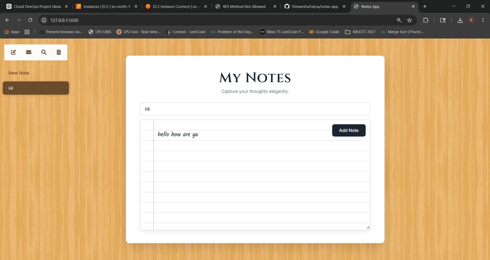
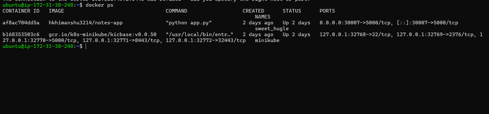
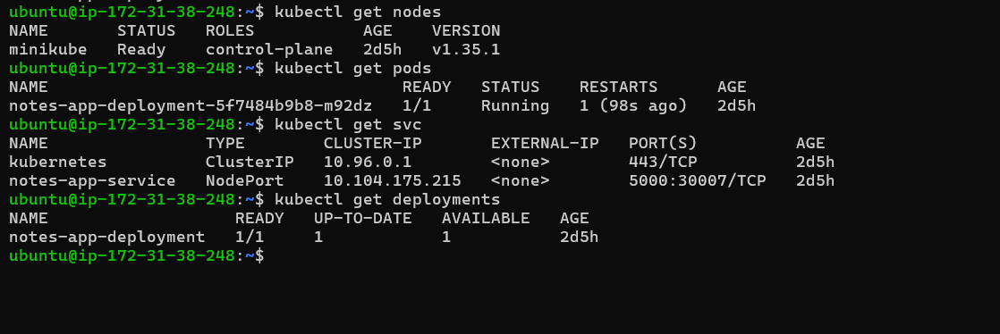
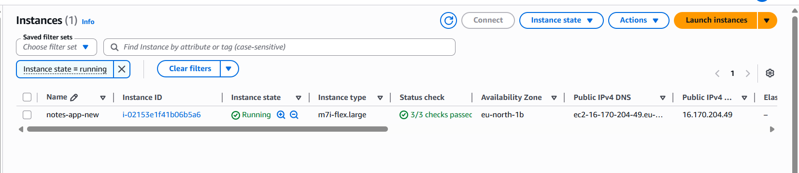

  # Containerized Notes App with Docker, Kubernetes & AWS

## Project Overview

This project is a cloud-hosted Notes Application developed using Flask and deployed using modern DevOps technologies including Docker, Kubernetes, and AWS EC2.

The application allows users to create, view, and delete notes through a simple and user-friendly web interface. The project demonstrates containerization, cloud deployment, and container orchestration concepts.

---

## Features

- Add Notes
- View Notes
- Delete Notes
- Responsive User Interface
- Containerized using Docker
- Kubernetes Deployment using Minikube
- Cloud Hosted on AWS EC2

---

## Technologies Used

| Technology | Purpose |
|------------|----------|
| Flask | Backend Framework |
| HTML | Frontend Structure |
| CSS | Styling |
| JavaScript | Client-Side Functionality |
| Docker | Application Containerization |
| DockerHub | Container Image Registry |
| Kubernetes (Minikube) | Container Orchestration |
| AWS EC2 | Cloud Hosting |
| Git & GitHub | Version Control |

---

---

## Screenshots

1. Application Homepage
   
2. Running Docker Containers (`docker ps`)
   
3. Kubernetes Pods and Services (`kubectl get pods` `kubectl get svc`)
   
4. AWS EC2 Dashboard
   

---

## Project Architecture

```text
User Browser
      │
      ▼
AWS EC2 Instance
      │
      ▼
Docker Container
      │
      ▼
Flask Notes Application
```

Kubernetes Components:

```text
Kubernetes Cluster (Minikube)
        │
        ├── Deployment
        ├── Pod
        └── Service
```

---

## Project Workflow

```text
Developer
   │
   ▼
Develop Flask Notes Application
   │
   ▼
Dockerize Application
   │
   ▼
Push Docker Image to DockerHub
   │
   ▼
Launch AWS EC2 Instance
   │
   ▼
Install Docker & Kubernetes
   │
   ▼
Deploy Application using Kubernetes
   │
   ▼
Run Application Container
   │
   ▼
Access Application via Browser
```

---

## Docker Setup

### Build Docker Image

```bash
docker build -t notes-app .
```

### Run Docker Container

```bash
docker run -d -p 5000:5000 notes-app
```

### View Running Containers

```bash
docker ps
```

---

## Kubernetes Setup

### Start Minikube

```bash
minikube start --driver=docker
```

### Verify Cluster

```bash
kubectl get nodes
```

### View Running Pods

```bash
kubectl get pods
```

### View Services

```bash
kubectl get svc
```

### View Deployments

```bash
kubectl get deployments
```

---

## Deployment Files

### deployment.yaml

Responsible for:

- Creating application pods
- Managing replicas
- Running Docker images

### service.yaml

Responsible for:

- Exposing application networking
- Connecting users to application pods

---

## AWS Deployment

1. Launch Ubuntu EC2 Instance
2. Configure Security Groups
3. Connect using SSH
4. Install Docker
5. Install Kubernetes (Minikube)
6. Deploy Application
7. Access Application using Public IP

Example:

```text
http://<EC2_PUBLIC_IP>:30007
```

---

## Useful Commands

### SSH into EC2

```bash
ssh -i "keypair.pem" ubuntu@<EC2_PUBLIC_IP>
```

### Docker

```bash
docker ps
docker images
docker stop <container_id>
docker start <container_id>
```

### Kubernetes

```bash
kubectl get nodes
kubectl get pods
kubectl get svc
kubectl get deployments
```

---

## Learning Outcomes

This project demonstrates:

- Cloud Computing
- Containerization
- Docker Image Management
- Kubernetes Deployment
- Container Orchestration
- AWS EC2 Administration
- DevOps Fundamentals
- Application Deployment Workflow

---

## Future Enhancements

- Jenkins CI/CD Pipeline
- Automated Deployment on GitHub Push
- Database Integration
- Persistent Storage
- Multi-Node Kubernetes Cluster
- Monitoring and Logging


**Himanshu Fulera**

Cloud Computing & DevOps Project
